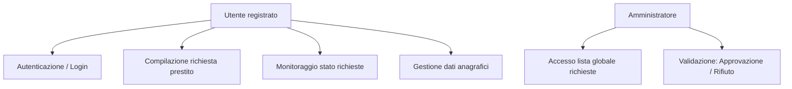

# LoanMate – Documentazione Tecnica

LoanMate è un'applicazione web full-stack progettata come caso studio per un project work universitario in ambito informatico. Il sistema si presta per la **gestione asincrona e autenticata delle richieste di prestito**, architettata secondo il paradigma RESTful. È composto da un'interfaccia utente sviluppata in **React + TypeScript** e un'infrastruttura backend realizzata in **Django**, integrata con il framework **Django REST Framework**.

---

## 1. Finalità del Progetto

L'obiettivo è la progettazione e l'implementazione di un'applicazione modulare, scalabile e conforme ai principi dell'ingegneria del software orientata ai servizi. LoanMate simula un contesto aziendale nel settore finanziario, fornendo funzionalità quali:

- Autenticazione tramite token e controllo accessi
- database e gestione delle richieste di prestito tramite interfaccia utente e API
- Separazione logica tra ruoli utente e amministratore
- Tracciabilità delle transazioni e logging degli eventi

---

## 2. Architettura Tecnologica

### 2.1 Tecnologie e Layer Applicativi

| Strato         | Tecnologia                      |
| -------------- | ------------------------------- |
| Presentazione  | React, TypeScript, Tailwind CSS |
| Backend        | Django, Django REST Framework   |
| Database       | SQLite                          |
| Documentazione | Swagger UI, ReDoc via drf-yasg  |

Il pattern architetturale è di tipo client-server con separazione delle responsabilità. La comunicazione avviene tramite richieste HTTP e risposte JSON, conformi allo standard OpenAPI 3.0.

---

## 3. Configurazione Locale e avvio rapido

### 3.1 Frontend

1. Installazione delle dipendenze:

   ```bash
   npm install
   ```

2. Creazione del file `.env`:

   ```env
   VITE_API_URL=http://localhost:8000/api
   ```

3. Avvio del server di sviluppo:
   ```bash
   npm run dev
   ```

### 3.2 Backend

1. Creazione e attivazione di un ambiente virtuale:
   ```python
   python -m venv venv
   source venv/bin/activate
   ```
2. Installazione delle dipendenze:
   ```python
   pip install -r requirements.txt
   ```
3. Migrazioni e creazione superuser:
   ```python
   python manage.py migrate
   python manage.py shell < create_admin.py
   ```
4. Avvio del server:
   ```python
   python manage.py runserver
   ```

---

## 4. Diagramma del Flusso Applicativo



---

## 5. Frontend – Architettura dei Componenti

### 5.1 Comportamento delle Pagine

| Componente      | Descrizione                                                              |
| --------------- | ------------------------------------------------------------------------ |
| WelcomePage     | Pagina iniziale con link a login, registrazione e documentazione API     |
| LoginPage       | Form per autenticazione, restituisce token JWT                           |
| RegisterPage    | Registrazione utente, con validazione dei dati inseriti                  |
| UserHomePage    | Dashboard con invio richiesta e lista dello storico personale            |
| UserProfilePage | Modifica dati personali (senza impatto retroattivo su richieste passate) |
| AdminHomePage   | Interfaccia per l'amministratore con validazione delle richieste         |

### 5.2 Flusso di Navigazione

```text
WelcomePage
├──> LoginPage
│    ├──> UserProfilePage
│    └──> AdminHomePage
└──> RegisterPage
     └──> LoginPage
└──> Collegamento a API Docs
```

---

## 6. Backend – Architettura e database

### 6.1 Creazione del Progetto Django loanmate

```bash
django-admin startproject loanmate
```

```
loanmate/
├── manage.py
└── loanmate/
    ├── settings.py
    ├── urls.py
    └── ...
```

### 6.2 Inizializzazione App "api"

```bash
python manage.py startapp api
```

Registrazione in `settings.py` di applicazioni aggiuntive:

```python
INSTALLED_APPS = [
    'api',
    'rest_framework',
    'drf_yasg',
    ...,
]
```

### 6.3 Modelli Dati

#### `CustomUser`

| Campo          | Tipo         | Descrizione                        |
| -------------- | ------------ | ---------------------------------- |
| email          | EmailField   | Identificativo univoco             |
| nome/cognome   | CharField    | Informazioni anagrafiche           |
| telefono       | CharField    | Numero di contatto                 |
| carta_identita | CharField    | Documento identificativo           |
| is_staff       | BooleanField | Indicatore di ruolo amministrativo |

#### `LoanRequest`

| Campo      | Tipo       | Descrizione                                  |
| ---------- | ---------- | -------------------------------------------- |
| user       | ForeignKey | Associazione con l’utente richiedente        |
| importo    | FloatField | Valore richiesto                             |
| motivo     | TextField  | Motivazione                                  |
| stato      | CharField  | Stato: `in attesa`, `approvata`, `rifiutata` |
| data_esito | DateTime   | Data di approvazione/rifiuto (opzionale)     |

---

## 7. API – Endpoint Principali

### 7.1 Autenticazione

- `POST /api/login/` → Login e generazione token
- `GET /api/user/` → Profilo utente autenticato

### 7.2 Richieste Prestito

- `POST /api/loan-requests/`

```json
{
  "importo": 1000.0,
  "motivo": "Acquisto libri"
}
```

### 7.3 Consultazione

- `GET /api/loan-requests/` → Admin: tutte le richieste
- `GET /api/loan-requests/mine/` → Utente: solo proprie

### 7.4 Aggiornamento Stato (Admin)

- `PUT /api/loan-requests/{id}/`

```json
{
  "stato": "approvata",
  "data_esito": "2025-07-13T14:00:00Z"
}
```

---

## 8. Documentazione API – Swagger e ReDoc

Grazie all’integrazione con `drf-yasg`, la documentazione viene generata dinamicamente e resa disponibile attraverso interfacce interattive.

### 8.1 URL di Accesso

- Swagger UI: [http://localhost:8000/swagger/](http://localhost:8000/swagger/)
- ReDoc: [http://localhost:8000/redoc/](http://localhost:8000/redoc/)
- OpenAPI JSON: [http://localhost:8000/swagger.json](http://localhost:8000/swagger.json)

### 8.2 Configurazione Schema drf_yasg

- `http://localhost:8000/swagger/` → interfaccia Swagger UI
- `http://localhost:8000/redoc/` → documentazione ReDoc
- `http://localhost:8000/swagger.json` → specifica OpenAPI in JSON

---

## 9. Conclusioni e Sviluppi Futuri

LoanMate costituisce un caso studio per l’implementazione di sistemi distribuiti e applicazioni web moderne. La separazione delle logiche di presentazione, business e database, unita all’adozione di pratiche RESTful e design modulare, ne fanno una base solida per progetti reali futuri.

### Possibili Estensioni:

- Integrazione di ulteriori servizi come gestione conti, simulazione investimenti e gestione polize assicurative
- Registrazione e gestione dei conti bancari degli utenti, con possibilità di associare IBAN per la ricezione e l’erogazione dei prestiti
- Generazione reportistica in PDF/Excel ad esempio dello stato delle rate

LoanMate si presta a essere adattato, esteso e integrato in contesti reali o sperimentali.

```

```
